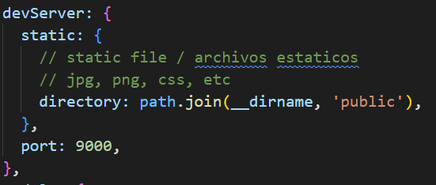
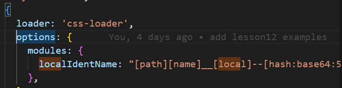
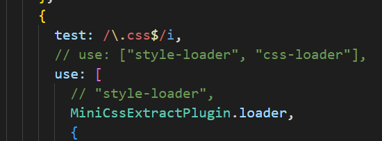
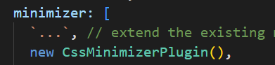
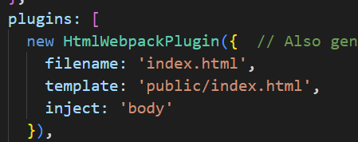
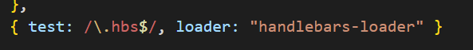
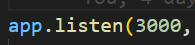

# Client

## Commands

Instalar las dependencias
> npm install

Arrancar el server (localhost:9000)
> npm run start

  
*webpack.config.js*

Generar archivos para realizar deploy, aqui webpack va a utilizar el archivo `webpack.config.prod.js`
> npm run build

## Deploy - Firebase

Firebase esta instalado de forma local, pero puede ser usado de forma global.

### Login en firebase
> npm run firebase-login

### Deploy

Va a ejecutar dos comandos, uno es `npm run build` y el otro es `firebase deploy`
>npm run deploy

## Env vars

Como en este caso la aplicacion corre en el browser, las variables de entorno se obtienen en el proceso de build y el webpack plugin [dotenv-webpack](https://www.npmjs.com/package/dotenv-webpack) va a reemplazar los usos en nuestro codigo de las mismas por sus valores reales presentes en el archivo `.env` o de las variables de entorno del sistema donde se este realizando el proceso de build.

## CSS

### [css-loader](https://www.npmjs.com/package/css-loader)
Permite importar (usando `require`) un archivo css como si de un modulo se tratase. Entre sus configuraciones, podemos usar css modules para hacer que los nombres de nuestras clases sean "unicas" y no entren en conflicto con otras de la aplicacion.

### [style-loader](https://www.npmjs.com/package/style-loader)
Permite que se injecten los estilos importados en el html entre etiquetas `<style>`

### [mini-css-extract-plugin](https://www.npmjs.com/package/mini-css-extract-plugin)

Permite extraer los estilos en un archivo css y el mismo es linkeado en nuestro index.html. Tambien permite minificar dicho archivo css.

*loader para prod - webpack.config.prod.js*

*css minimize para prod - webpack.config.prod.js*

### [html-webpack-plugin](https://www.npmjs.com/package/html-webpack-plugin)

Crea un archivo html en el cual va a injectar el bundle generado por webpack. Podemos decirle que tome un html como base a modo de `template`

### [handlebars-loader](https://www.npmjs.com/package/handlebars-loader)

Permite utilizar Handlebars como un motor de template para la creacion de nuestras vistas. Este loader va a aplicar con los archivos cuyos nombres terminen en `.hbs`. Este loader es opcional.

https://handlebarsjs.com/

# Server

## Commands
Instalar las dependencias
> npm install

Arrancar el server (localhost:3000)
> npm run server

  
*app.js*

# Env vars

Las variables de entorno permiten que el codigo sea agnostico del ambiente donde este corriendo. Por ejemplo, supongamos que tenemos un entorno de desarrollo y otro productivo, cada uno tiene sus propias base de datos y otros recursos, por ende podriamos usar variables de entorno para que el mismo codigo pueda consumir los recursos segun el ambiente sin necesidad de cambiar el codigo.

En node, podemos usar [dotenv](https://www.npmjs.com/package/dotenv) ya que en cada sistema operativo las variables de entorno se configuran de forma distinta, este paquete permite definir un archivo `.env` con las variables de entorno. Este archivo no se debe versionar (en el ejemplo esta presente para mostrar sus formato y uso) ya que contine datos sensibles, este archivo se debe insertar en el proceso de deploy o configurar las variables en la plataforma usada (AWS, Azure, etc).